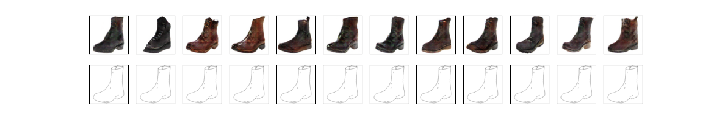

# NAM: Non-Adversarial Unsupervised Domain Mapping
> PyTorch implementation of NAM: Non-Adversarial Unsupervised Domain Mapping [1] for MNIST, SVHN, edges2shoes and edges2handbags datasets. The code can be easily extended to other datasets, examples have been given below. This code is under active development.

This code was written by Yash Belhe.

From qualitatve assesments, the code produces results similar to those in the paper as show below.




The structure of this codebase is heavily inspired by [this amazing UNIT PyTorch implemenation](https://github.com/mingyuliutw/UNIT).

## Getting  Started
### Requirements

* PyTorch 0.4
* PIL
* numpy
* torchvision
* yaml
* shutil
* matplotlib

## Usage example (edges2shoes)

Download the dataset:

```sh
sh datasets/download_edges2shoes.sh
```

Download Pre-Trained VGG-19 weights [here](http://www.vlfeat.org/matconvnet/models/imagenet-vgg-verydeep-19.mat "imagenet-vgg-verydeep-19.mat"). (For perceptual loss).
Download Pre-Trained Generator [here](https://drive.google.com/open?id=16XVS2B86o1lyrYeol533lhkO_1upgcrm "generator_shoes.pkl").
Move both downloaded files i.e. imagenet-vgg-verydeep-19.mat and generator_shoes.pkl to the models folder.

Start Training:
```sh
python train.py --config configs/edges2shoes.py
```

Outputs during training and model checkpoints are stored here 
```sh
ouputs/edges2shoes
```

The outputs during training may not seem very impressive, that is because we are performing the optimization over a single random seed for the Z vector.

Testing/ Evaluation:
```sh
python eval.py --config configs/edges2shoes.py
```

Running this script produces the outputs here:
```sh
ouputs/edges2shoes/evaluation
```
These generated images should be of similar quality to the ones shown in header.

## Custom Dataset

[Complete this later]
Make a copy of one of the config files in the configs folder.

The source train/ test datasets location can be set through src_dataset_train/ src_dataset_test.
All other relevant hyperparameters can be modified through this file as well. 